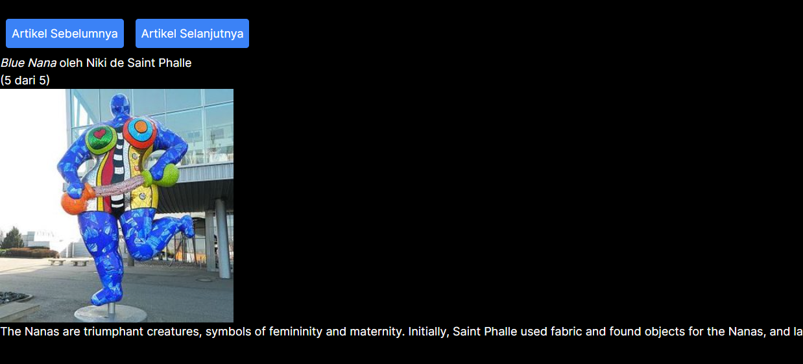

### Penjelasan Praktikum 2🎅

Fungsi Tombol_2 memiliki 2 parameter yaitu isiPesan dan namaTombol, pada <b>page.tsx </b> pemanggilan <i>Tombol_2</i> diikuti dengan isi untuk kedua parameter, yaitu "Ini Pesanku" dan nama tombol "Pesan"

### Penjelasan Praktikum 4

1. Akan terjadi error ketika menekan artikel selanjutnya setelah artikel ke 5.
2. Hasil sesudah di fix :

### Penjelasan Praktikum 5

1. Tidak ada perbedaan
2. Untuk menghindari redundan dan bug pada aplikasi react

### Penjelasan Praktikum 6